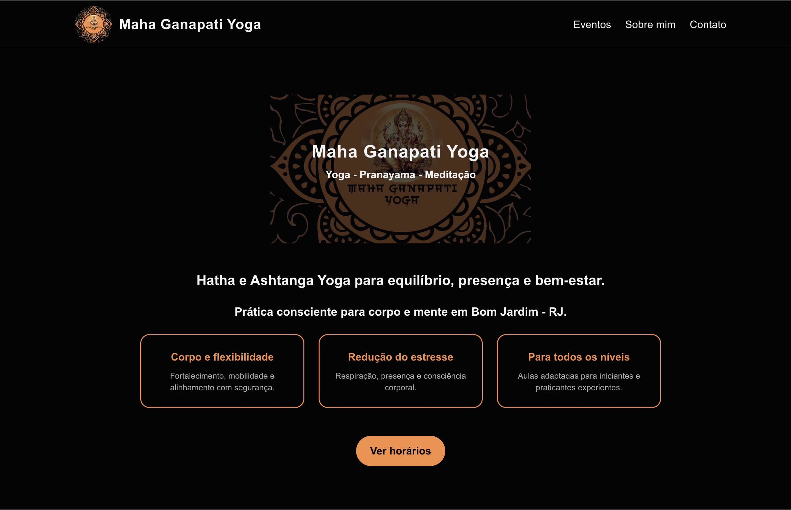

 # Maha Ganapati Yoga – Studio Website

 
 


## Live Website

Check out the live Maha Ganapati Yoga website on Vercel:
(https://maha-ganapati-yoga.vercel.app)


**Next.js + Tailwind CSS website for Maha Ganapati Yoga studio** – fully responsive, with contact form integration using EmailJS, WhatsApp & Instagram links, and dynamic event listings.

---

## About the Project

This website was built for **Maha Ganapati Yoga**, a yoga studio founded in 2019 in Bom Jardim, Brazil. The goal of the project was to create a **modern, responsive online presence** for the studio that allows clients to:  

- View studio information and teacher bio  
- Check events and schedules  
- Contact the studio directly via form, WhatsApp, or Instagram  

The website was built entirely with **Next.js** and **Tailwind CSS** for fast performance, responsive design, and ease of maintenance. All form submissions are handled on the client side using **EmailJS**, so no backend server was needed.

---

## Features

- **Responsive design** – works perfectly on mobile, tablet, and desktop  
- **Contact page** with EmailJS integration  
- **WhatsApp & Instagram links** for direct communication  
- **Events page** with a clean, dynamic grid layout  
- **Faint background logo** effect for modern visual appeal  
- **Spam protection** included in the contact form  
- **Accessible and SEO-friendly structure**

---

## Tech Stack

- **Frontend:** Next.js (React)  
- **Styling:** Tailwind CSS  
- **Forms:** EmailJS (client-side email sending)  
- **Icons:** Custom SVG components for WhatsApp & Instagram  
- **Deployment:** Vercel  

---

## Role & Contributions

I handled **the entire frontend development** for this project, including:  

- Building **responsive layouts** for mobile and desktop  
- Implementing **EmailJS form integration** with spam protection  
- Integrating **social media links** (WhatsApp & Instagram)  
- Creating **dynamic event listings** with styled cards  
- Optimizing images and visual elements for performance  

---

## Getting Started (For Developers)

If you want to run this project locally:

1. Clone the repo:
```bash
git clone https://github.com/yourusername/maha-ganapati-yoga-website.git
```

2. Install dependencies:
```bash
npm install
# or
yarn install
```

3. Add EmailJS environment variables in .env.local:
```bash
NEXT_PUBLIC_EMAILJS_SERVICE_ID=your_service_id
NEXT_PUBLIC_EMAILJS_TEMPLATE_ID=your_template_id
NEXT_PUBLIC_EMAILJS_PUBLIC_KEY=your_public_key
```

4. Run the development server:
```bash
npm run dev
# or
yarn dev
```

Open http://localhost:3000 to view it in your browser.

## License

This project is built for the client Maha Ganapati Yoga. Not for public redistribution without permission.